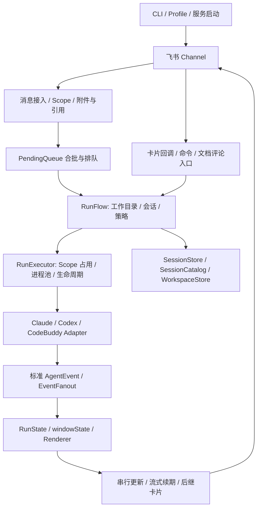

# 架构、竞品与长任务体验研究

日期：2026-09-17。代码基线：`003f01e`，package 版本 `0.3.17`。状态：调查记录。用户已接受“运行中显示最新思考，完成后通过独立入口查看完整已接收的思考记录”；其他优化仍为建议。后续用户要求只交付文档，由其他 Agent 逐项实施。未修改产品代码。

## 1. 结论和证据边界

最优先的问题是长任务信息是否及时、准确、可追溯，而非继续增加 Agent 或 IM 数量。项目已有多 Agent、会话隔离、策略控制、服务化和卡片恢复机制，基础明显超过简单文本转发器；薄弱处集中在执行事实如何变成用户能够理解和操作的任务状态。

“思考内容达到一定数量不再更新”在当前源码的卡片渲染路径中已经确定性复现。用户随后确认是 CodeBuddy 卡片的「🧠 思考中」或「🧠 思考完成，点击查看」。CodeBuddy adapter 复用 Claude stream-json translator，确实进入这一渲染链路；两个面板都使用同一截断逻辑。现场安装版本尚未核对，不能直接把这一根因推广到所有停更情况。

客观比较采用统一维度：接入成本、会话模型、长任务可见性、远程交互、恢复能力、维护范围。对本项目使用源码与本地执行证据；对竞品使用维护者公开文档。未进行竞品部署、故障注入、延迟或资源占用横测，所以不给“稳定性第一”等排名，也不把 README 声明当成实测结论。以下竞品代价是基于其功能范围的工程判断。

## 2. 当前架构



| 模块 | 职责与已确认设计 | 评估 |
|---|---|---|
| CLI、Profile、服务管理 | 扫码接入；三种 Agent；Profile 隔离；跨平台后台服务 | 贴合个人本地 Agent 场景；继续保持低接入成本 |
| 接入与 Scope | 私聊/普通群按 chat；话题群按 chat + thread；文档评论有独立入口 | 有明确隔离，不应在竞品对比中误写为“没有会话隔离” |
| PendingQueue、ActiveRuns、ProcessPool | 短窗口合批、运行中积压下一轮；同 Scope 一个运行；全局进程并发控制 | 顺序清晰，但“补充下一轮”和“立即改变当前任务”是不同能力 |
| RunFlow、Policy | 工作目录真实路径、权限上限、附件决策、策略指纹、兼容会话恢复 | 改造审批和会话时应复用这些边界 |
| AgentAdapter、AgentEvent | 本地子进程输出转为统一事件 | 公共接口简洁，但表达不了结构化审批、任务清单等丰富交互 |
| Card | reducer 与 renderer 分离；工具聚合；正文窗口；续期和 rollover | 适合局部改进，不需要先重写整个项目 |
| 状态与诊断 | 会话/工作区持久化、原子写入、运行日志、doctor、last | 会话恢复不等于运行中任务恢复，也不等于完整执行历史 |

主要源码入口：`src/bot/channel.ts`、`src/bot/run-flow.ts`、`src/runtime/run-executor.ts`、`src/agent/types.ts`、`src/agent/capability.ts`、`src/card/run-state.ts`、`src/card/run-renderer.ts`、`src/card/streaming-session.ts`。

架构上的保留项：不要绕过 RunPolicy 直接启动子进程；不要在 bot/card 引入某个 Agent 的内部模块；不要破坏每个 Scope 单运行的约束。当前静态契约已经检查公共层不导入 Codex/CodeBuddy 内部代码。

## 3. 思考区停更：确定性复现

### 已确认链路

1. `src/card/run-state.ts:72` 收到 `thinking` 后不断追加 `evt.delta`。
2. `src/card/run-renderer.ts:4` 固定 `REASONING_MAX = 1500`。
3. `reasoningPanel` 调用 `truncate`，后者使用 `slice(0, max)`，保留最前面的内容。
4. 超过阈值后，最新事件改变内存中的内容，却不改变思考区正文。

这里的 1,500 是 JavaScript 字符串长度，即 UTF-16 code unit，不严格等于可见汉字数，也不是飞书官方限制。扩大这个值只会推迟复现。

已运行真实模块的最小检查，命令：

```powershell
node .harness/research/repro-thinking.cjs
```

结果：

```json
{"storedBefore":1600,"storedAfter":1623,"renderedCardsIdentical":true,"latestMarkerVisible":false}
```

命令按预期返回 exit 1，断言是“新增思考必须能改变可见卡片”。此脚本不调用飞书，也不启动 Agent。它证明渲染缺陷，不能替代用户现场端到端验证。

### 相关缺口

- `/last` 的 `fullText` 只收集 `text` 和 `final_text`，不收集 `thinking`。因此当前 `/last` 不是完整思考记录入口。
- 正文使用约 4,000 字符的尾部窗口，思考使用前部窗口，两者语义不一致。
- `windowState` 保留所有工具结构，原始思考也持续累积。卡片体积受控不等于运行内存受控。
- `EventFanout.buffer` 保留运行事件；消费端逐事件等待卡片更新。网络慢时，事件仍可被读取进缓存，而呈现可能积压。这是源码层面风险，尚未压测量化。
- `ResilientCardUpdater` 默认立即重试两次后发送后继卡片，未在该层区分内容超限、限流、权限错误、临时网络故障。相同无效 payload 换卡也可能继续失败。
- Codex translator 当前主要映射 agent_message 和 command_execution，没有映射 reasoning item；若用户说的是 Codex 正文停更，要检查其消息暂存和最终答复分流，不能套用思考截断结论。

源码还有每 8 分钟续期的机制，并识别部分流式失效错误；所以不能笼统归因为“没有处理长时间流式过期”。源码注释提及的平台超时和大小限制本次未从飞书官方接口页面独立验证，不据此给出通用数值保证。

### 改进提案

第一步保留有界窗口，改为展示最新内容；提示“显示最近内容，前文已折叠”；显示最后一条 Agent 事件时间。用新事件序号或可见字符计数避免用户把相似文字误判为停更。截取时考虑 Unicode、Markdown 段落和未闭合代码块。

第二步再决定历史查询：独立的按 runId 查询记录入口，明确包含哪些正文、工具事件、上游公开的思考或推理摘要；支持分页、范围权限与保留期。不能承诺提供上游根本没有公开的模型内部推理。

第三步把“接收事件”与“发送卡片”解耦。事件及时归并，卡片只发送最新快照；正常运行采用可配置的合并节奏，终态必须强制刷新。重试按错误类别处理，并以序号防止旧进度覆盖终态。

## 4. 同类产品比较

以下是公开文档支持的能力，不是横向性能测试。

| 产品 | 已公开亮点 | 与本项目相比的价值和代价 | 借鉴优先级 |
|---|---|---|---|
| [cc-connect](https://github.com/chenhg5/cc-connect) | 多 IM、多 Agent、ACP、聊天中切模型/推理强度/权限、Web 配置 | 广度和远程配置更完整；适配矩阵更大，功能存在不代表各后端体验一致 | 中：先学能力声明和可发现的控制入口；多平台扩张后置 |
| [feir/feishu-bridge](https://github.com/feir/feishu-bridge) | Todo 进度、多 Agent 状态、context 告警、富信息卡片 | 与飞书场景最接近，任务进度比纯文本更容易理解；依赖后端事件语义，卡片也可能信息过载 | 高：学阶段和任务状态，按需展开元数据 |
| [Claude-to-IM Skill](https://github.com/op7418/Claude-to-IM-skill) | 聊天内工具审批、会话持久化、skill 安装工作流 | 审批闭环值得借鉴；公开文档区分平台，飞书为文本审批，流式预览列表重点列 Telegram/Discord，不能假定各平台同等能力 | 中高：学交互闭环，不照搬所有逐次审批 |
| [agents-to-im](https://github.com/francize/agents-to-im) | 私聊管理，一群一会话，活动/审批卡片 | 会话身份更直观；群数量与管理成本随任务增加。本项目已有 `/new chat` 和 Scope 隔离，改进应建立在现有能力上 | 中：让项目、Agent、会话身份持续可见，提供会话索引 |
| [OpenClaw 飞书插件](https://docs.openclaw.ai/channels/feishu) | 飞书工具和路由生态 | 属于更广的 Agent 平台，范围不完全对等；整体迁移收益需要另证 | 高：只借鉴投递和恢复机制 |

OpenClaw 文档中最值得直接学习的是两件事：按序列化消息大小拆分，和在分发前持久化入站事件、以事件 ID 去重。前者在[高级配置](https://docs.openclaw.ai/channels/feishu/advanced-configuration)中说明，后者在[接入持久性](https://docs.openclaw.ai/channels/feishu/setup)中说明。这里引用的是其自身实现说明，不替代飞书接口规范。

本项目已具备扫码、会话/工作区管理、Profile、图片文件、文档评论、身份策略、签名回调、后台服务、流式续期等能力。不能把竞品同名功能全部列成待补功能。可确认差距主要是更丰富的运行交互、可靠进度呈现和历史访问路径，而非“缺一个完整框架”。

## 5. 优化优先级与验收

| 优先级 | 改进 | 收益 | 验收建议 | 成本判断 |
|---|---|---|---|---|
| P0 | 思考尾部窗口和隐藏提示 | 直接解决已复现的停更错觉 | 1,499/1,500/1,501 和长文本追加可见；emoji/段落边界正常 | 小 |
| P0 | 区分 Agent 活动时间与卡片送达时间 | 用户知道是 Agent 无事件还是展示滞后 | 慢 API 注入时显示送达滞后；成功恢复后状态归位 | 中 |
| P1 | 快照合并、终态优先、分类重试 | 减少积压和无效重试 | 高频事件+慢 API 下最新状态可达；终态不被旧快照覆盖 | 中 |
| P1 | 卡片总字节预算与分页/结果附件 | 长中文、代码、多文本块稳定交付 | 用实际序列化 UTF-8 字节计数；极长内容不只截断无入口 | 中 |
| P1 | 按 runId 查询执行记录 | 让 last/doctor 之外有任务历史 | 明确正文/工具/推理摘要范围；跨 Scope 访问拒绝；到期清理 | 中大 |
| P1 | 入站持久队列、幂等和恢复状态 | 降低服务重启后的丢单/重复启动 | 入队后重启不丢消息；重复事件不重复启动；执行状态不明时禁止盲目重跑 | 大 |
| P2 | 结构化等待输入/审批事件 | 远程任务不再因交互卡住 | 能力支持才展示；请求有 runId、requestId、操作人、过期与一次性校验 | 大 |
| P2 | 任务步骤与成果摘要 | 用户能理解进度和拿到结果 | 仅从真实事件生成；区分工具成功、测试通过和任务完成 | 中 |
| P3 | ACP 或更多 IM、Agent | 扩大覆盖范围 | 先证明现有三后端能力差异可声明、可测试 | 大 |

优先级基于当前“移动端查看本地长任务”的场景。成本是相对量级，不是工期承诺。

建议追踪的指标：事件收到到卡片成功送达的延迟、失败更新比例、每个运行的 rollover 次数、结果可恢复率、事件缓存峰值。先采样建立基线，再制定延迟目标，避免凭空写 SLA。

## 6. 可以突破现有形式的设计

### 任务视图与记录视图分开

默认卡片持续回答四件事：现在做什么、最近完成什么、是否需要用户处理、结果在哪里。正文、工具和上游公开推理摘要放入可展开或可查询的记录。这样不要求用户阅读长思考来猜测进度，也保留诊断能力。

### 可核验的完成凭据

结束卡展示本次修改文件、实际运行的检查、检查结果、产物入口、未完成事项。尽量来自工具或后端结构化事实；仅由模型陈述的“测试通过”应标明来源。进程正常退出不能自动等同于用户目标完成。

### 补充消息的意图分流

运行中收到新消息，提供“加入下一轮 / 更新当前要求 / 停止后重做”。默认维持现有排队语义；只有后端支持 steer/input 时才开放即时补充，禁止把不支持的能力伪装成按钮。

### 恢复卡而不是盲目重跑

服务恢复后显示：最后确认的阶段、是否仍有原进程、最后送达状态、可恢复会话。文件修改或外部操作是否执行成功不明时，先检查实际副作用。持久队列只能保证消息记录，不自动提供副作用 exactly-once。

### 自适应信息密度

短任务只显示答复；长任务显示最近进展和阶段；异常任务优先显示可操作的故障信息。允许用户选简洁/详细。若增加模型生成摘要，应将它标成摘要，保留事件依据，并核算延迟与 token 成本。

## 7. 待讨论的领域词汇

以下为候选词，不是已确认的项目术语，暂不写入正式 CONTEXT.md。

| 词 | 候选含义 |
|---|---|
| 会话 | 跨多轮交互的上下文连续性 |
| 运行 | 一次从提交到终态的 Agent 执行 |
| 进度 | 用户可观察的最新活动、阶段或等待状态，不是完成率猜测 |
| 推理摘要 | 上游明确公开的 reasoning/thinking 内容，含义由后端能力声明 |
| 执行记录 | 按运行组织的正文、工具事件和可选公开推理内容 |
| 投递状态 | 桥接器是否把某个版本的内容成功送到飞书 |

已确认现场现象是 CodeBuddy 的思考面板，安装版本尚待后续实施时核对。用户已接受默认追踪最新思考、历史用独立入口。具体命令、分页、保留范围和存储方式尚未采纳，参见 OPT-01。

没有将研究提案写成 ADR：已接受的是用户可见行为，尚未选择难以逆转的架构或存储决策。当前按用户后续指令仅交付文档。

## 8. 已执行验证与未覆盖范围

- 真实 reducer + renderer 最小检查：预期失败，确定复现超限思考不可见。
- `pnpm exec vitest run tests/unit/card/run-renderer.snapshot.test.ts tests/unit/card/run-state-schema.test.ts tests/unit/card/streaming-session.test.ts tests/unit/card/resilient-updater.test.ts`：4 个文件，41 项通过。
- 现有快照的思考样例较短，测试通过不能证明超限追加可见。
- 未修改产品源码，未部署、重启服务或发送飞书消息。
- 未验证当前运行安装包与源码基线一致，未获取用户现场日志。
- 未对竞品执行功能横测；功能差异为公开文档级结论。
- CodeGraph 已用于定位，具体结论回到当前源码核查；仓库指引提及的 `.harness/codebase/map/` 当前不存在。

原始调查记录与辅助复现脚本保存在 gitignored 的 `.harness/research/`。本目录提供可随仓库交接的方案文档；正式回归测试逻辑见 `03-verification.md`，不依赖本地辅助脚本。未写入跨项目长期记忆。
