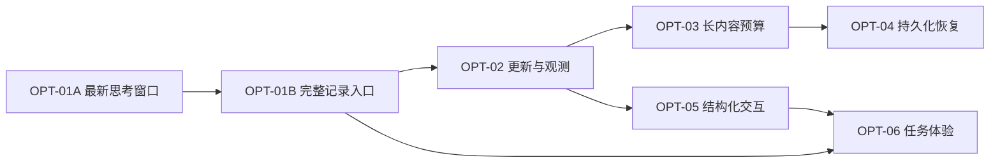

# 路线图与任务依赖

## 排序原则

先解决用户已经遇到的可见性缺陷，再解决高频事件、长内容和故障恢复，最后扩展交互与任务体验。多 IM、多 Agent 数量扩张暂不进入近期实现范围。

| 任务 | 优先级 | 核心交付 | 相对工作量 | 决策状态 |
|---|---|---|---|---|
| OPT-01 | P0 | 最新思考窗口 + 完整思考查询入口 | 中 | 产品方向已接受，具体接口待设计 |
| OPT-02 | P1 | 快照合并、终态优先、分类重试、双时间戳 | 中 | 建议 |
| OPT-03 | P1 | 序列化预算、分页/分段、完整结果交付 | 中 | 建议 |
| OPT-04 | P1 | 入站持久化、幂等、恢复状态 | 大 | 建议；持久化语义需明确 |
| OPT-05 | P2 | 能力声明、等待输入/审批闭环 | 大 | 建议；按后端逐项开放 |
| OPT-06 | P2 | 任务视图、完成凭据、信息密度 | 中 | 建议；不等于已授权重设计 |

工作量是相对复杂度，不是工期估算。优先级针对当前“通过飞书控制本地 Agent、查看长任务”的使用场景。

## 推荐顺序

图中部分连线表示推荐先后，不全是技术硬依赖：

- OPT-01A 与 01B 可以分别提交，但两者都完成才满足已接受的产品方向。
- OPT-01B 不必等待通用卡片预算系统，可先为自己的分页实现明确的安全预算。
- OPT-02 和 OPT-03 可独立设计，但都修改投递链路，默认串行实施更易检查。
- OPT-04 的持久入站队列不硬依赖卡片改造；排在后面是为了控制风险。运行恢复关联 runId 时需复用已有记录身份。
- OPT-05 和 OPT-06 在 AgentEvent 能力、终态含义上有关联，应先确定契约。

## 分阶段交付

### 第一阶段：用户能看到最新思考，也能找回历史

范围仅 OPT-01。完成标准：超限追加可见，完成后的完整思考可以被分段检索，旧卡片入口不会静默指向另一个运行，重启和 Scope 隔离语义明确。

### 第二阶段：长任务不会因显示链路逐渐失真

范围 OPT-02、OPT-03。完成标准：慢 API 不产生无限待发送快照，终态有送达结果，序列化体积有可验证上限，长内容有完整访问路径。

### 第三阶段：故障和远程交互可处理

范围 OPT-04、OPT-05。完成标准：重启后显示明确状态，重复投递不重复启动已认领任务，操作结果不明时不盲目重跑，支持的后端可以在飞书内回答输入请求。

### 第四阶段：任务体验提升

范围 OPT-06。完成标准：默认视图能说明当前活动、用户待办和结果；完成声明有证据；详细记录仍可访问。

## 暂不纳入

- 把项目替换为 OpenClaw，或同时重写所有 Adapter。
- 引入数据库、事件总线等基础设施而没有容量或恢复需求支撑。
- 多平台扩张、自动多 Agent 调度、后台模型生成摘要。
- 将群共享 Scope 默默改成按用户隔离；这是产品行为变化。
- 自动修改权限默认值、部署服务、发布 npm 包。

## 建议验证的产品假设

1. 最近活动 + 完整记录比无限增长卡片更适合移动端。观察用户查历史的频率和误判卡住的反馈。
2. 按实际投递状态报告异常能减少无效 `/stop` 或重复提交。先建立基线，不提前承诺降幅。
3. 完成凭据能减少“显示成功但任务没完成”的误解。区分进程终态、检查结果和目标达成。

如假设不成立，调整展示和交互方案，不为维护原方案而继续堆叠功能。
